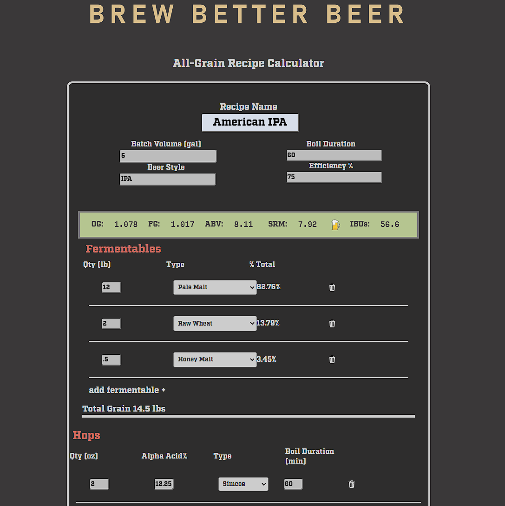

# BrewTools

## Description

BrewTools is a complete recipe-builder/calculator app for brewers. Craft your next beer from our library of malts and hops and generate accurate vital statistics such as alcohol content, hop bitterness, and approximate color. 

Create an account and save your recipes to view at any time - its 100% free with no limit on how many recipes you store.

Deployed Application Screenshot:

---

## Installation

If you're a user, there's no installation required - just follow this link: [BrewTools](https://brewtools-046156aef935.herokuapp.com/recipecalc "brewtools.com")

For collaborators interested in forking or copying the repository, please see the instructions below.

Run the following commands in the terminal of the root folder

1) To install the Concurrently package:

        npm i

2) To install all client and server dependencies:

        npm run install

3) To open the application in developer mode:

        npm run dev

---

## Usage

1) Login using your existing credentials or register as a new user

2) Build your recipe from our database of fermentables, hops, and yeast strains. You can adjust parameters such as mash efficiency and batch size to fit your brew system.

3) Press Calculate to generate batch statistics and then press save to store it to our recipe database - your recipes are private and only viewable by the creator.

---

## License

Please refer to the repository for a copy of the license. 
